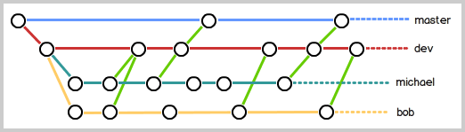

# git笔记
---

## 常用命令：
|命令|解释|
|---|---|
`git add file`				|			    		添加文件到暂存区
`git add .`					|						添加工作区所有文件到暂存区
`git commit -m "tip"`|					    		将暂存区所有文件上传到仓库，备注tip
`git log`	|										查看提交到仓库的时间戳和地址
`git status`	|									查看工作区，暂存区，仓库的区别
`git diff`		|									比较工作区与暂存区的区别
`git diff --staged`		|							比较暂存区和仓库的区别
`git status`|                                       红色字提示工作区和暂存区存在差异，绿色字提示暂存区和仓库存在差异
`git reset --hard id`|                              改仓库，将工作区，暂存区回退到对应id的仓库版本（会删除所有没有提交的修改，所以慎重使用）
`git reset --hard HEAD^`|                           仓库回退到上一个版本
`git checkout -- file`|                             若暂存区不为空，工作区被暂存区覆盖；若为空，被仓库覆盖。可以实现类似于“一键还原”的功能
`git reset HEAD file`|                              暂存区被仓库最新版本覆盖，工作区不变
`rm file`|                                          删除工作区文件
`git rm file`|                                      删除工作区和暂存区文件
`git log --oneline`		|							只用一行显示日志
`git remote add origin git@github.com:用户名/仓库名.git`	|	将本地与远程库（github中创建的仓库）关联。**通用约定**：以`origin`作为远程库的默认名字
`git remote add origin https://github.com/用户名/仓库名.git`	|同上
`git remote remove origin`			|				删掉旧的关联
`git remote -v`				|						检查关联
`git push -u origin master`			|					第一次推送
`git push`					|					    	以后上传
`git clone git@github.com:用户名/仓库名.git`		|	从远程克隆下来
`git clone https://github.com/用户名/仓库名.git`	|	同上
`git checkout -b dev` 或 **`git switch -c dev`**       |							               	创建并切换到dev分支
`git checkout dev` 或 **`git switch dev`**	|						            			切换到dev分支
`git branch -d dev`	|									删除dev分支
`git branch -D dev`	|									强制删除dev分支
`git merge dev`	|										将dev分支合并到默认(master)分支
`git branch`	|										查看所有分支(带*号的就是当前分支)
`git pull origin master`    |							拉取远程代码并与本地代码自动合并
`git stash`    |										暂存当前工作进度，工作区变得干净
`git stash pop`    |									释放暂存代码并删除暂存区内容
`git stash apply`    |									释放暂存代码但不删除暂存区内容
`git stash drop`    |									删除暂存区内容
`git stash list`    |									查看暂存区内容
`git stash apply stash@{0}`    |						释放指定暂存代码
---
## 常用快捷键：
|快捷键|功能|
|---|---|
`CTRL+C`	|									    	停止工作区卡住
`CTRL+INSERT`						|                   复制
`SHIFT+INSERT`						|                   粘贴
---
## 可能遇到的情况
1. **远程仓库的默认分支是 main，而本地仓库的默认分支是 master。**

   -   方案 A：直接改掉默认分支的名字
 GitHub 的仓库页面， More - Settings - General - Default branch，有一个画笔的图标，点击，把它从 main 名字改成 master。
   -   方案 B：在本地把 master 和 main 对齐
如果不想改 GitHub 的设置，在本地终端按顺序敲这三行命令把它们合并：

        ```bash
        git pull origin main
        git checkout main
        git merge master
        ```    
   -   方案 C：如果不想更改
GitHub 的仓库页面， More - Settings - General - Default branch，有一个双箭头图标，点击把它从 main 改成 master。(**好处在于`git clone`的时候，默认clone的是 master 分支，而不是 main 分支。**)

2. **使用`git log`的时候，可能会显示非常长的信息，最后是一个冒号`:`，这时候你会发现无法输入命令。**

   -   解决办法：按下`q`键退出

3. **当`git merge`出现冲突时**
   -    `git merge <branch-name>`之后，显示类似于如下信息表示冲突：
        ```bash
        $ git merge <branch-name>
        Auto-merging <file-name>
        CONFLICT (content): Merge conflict in <file-name>
        Automatic merge failed; fix conflicts and then commit the result.
        ```
   -    通过`git status`可以查看哪些文件存在冲突：
        ```bash
        $ git status
        On branch master
        Your branch is ahead of 'origin/master' by 1 commit.
        (use "git push" to publish your local commits)

        You have unmerged paths.
        (fix conflicts and run "git commit")
        (use "git merge --abort" to abort the merge)

        Unmerged paths:
        (use "git add <file>..." to mark resolution)
                both modified:   <file-name>
        ```
   -    打开冲突的文件，你会看到 Git 会在冲突的地方标记出冲突的内容，标记的格式如下：
        ```bash
        <<<<<<< HEAD
        // 你的代码
        =======
        // 其他分支的代码
        >>>>>>> other-branch-name
        ```
        `HEAD` 表示当前分支的代码，`other-branch-name` 表示你要合并的分支的代码。
   -   解决办法：手动编辑文件，删除冲突标记，保留你想要的代码，然后保存文件。
   -   最终通过`git log --graph --oneline --all`查看提交记录，确认冲突已经解决。
        ```bash
        $ git log --graph --oneline --all
        *   31053e0 (HEAD -> master) 解决冲突
        |\
        | * 7bc0503 branch-point
        * | ef00fae branch-master
        |/
        * 9d7de85 (origin/master) 制造冲突
        * 81dc654 更新了一些内容
        ```

4. **潜在冲突情况**
   -   远程库提供了最初版本A，此时每个成员将A克隆到本地，然后成员1在本地修改A得到A1，成员2在本地修改A得到A2，然后成员1率先将A1提交到远程库覆盖A，此时没有任何问题，但是成员2也将A2提交到远程库，这时候就有可能出现冲突。
   -   解决办法：成员2通过`git pull origin master`拉去最新的远程库，该指令能够拉去并自动合并 A1 , A2 ,这时候如果没有冲突，就正常`git add、commit、push`就可以了，如果有冲突，就需要手动解决冲突(详见3)，然后再`git add、 commit、push`。

5. **通用约定**
   - 默认分支是`master`，在这上面不进行任何修改操作，这条分支是最终结果
   - 开发分支是`dev`，在这上面进行所有的修改操作
   - 成员自己分支尽量用自己的名字命名，例如dev-myname。
   - 也就是说，每个成员都在自己的分支上进行修改，修改完成后，提交到`dev`分支，最后由`dev`分支合并到`master`分支。
   - 参见下图：
    

6. **在dev上面工作到一半时（还不能上传），master分支上出现bug**
   - `git stash`暂存（保存当前进度），工作区变得干净
      - **注意**：这里需要配合着`git add`使用，先将工作区的修改添加到暂存区，然后再`git stash`。情况如下：
        ```bash
        $ git status
        On branch dev #显示在dev1分支上的更改
        Untracked files:
        (use "git add <file>..." to include in what will be committed)
                change1.txt
                change2.txt

        $ git stash
        No local changes to save
        #在没有git add的情况下，git stash会提示没有修改可以暂存

        $ git add .

        $ git stash #git add之后，git stash就可以正常使用了
        Saved working directory and index state WIP on dev: 
        aca55ce <last commit tip>
        ```  
   - 切换到`master`去修bug，通常修bug需要新建一个分支，在分支上修好后合并回去
   - 修好后切回dev分支，用`git stash pop`释放暂存代码（读取当前进度）
  **进阶：**    
   - 创建了多个分支并且在每个分支上都使用了`git stash`，这时候可以用`git stash list`查看所有的暂存代码，然后用`git stash apply stash@{0}`释放指定的暂存代码：
        ```bash
        $ git stash list
        stash@{0}: WIP on dev2: aca55ce <last commit tip>
        stash@{1}: WIP on dev1: aca55ce <last commit tip>

        $ git stash apply stash@{0}
        On branch dev2
        Changes to be committed:
        (use "git restore --staged <file>..." to unstage)
                new file:   change_on_dev2.txt
        ``` 
    -   由于dev导入了master，master上存在bug时候意味着dev上也可能存在bug，如果此时在dev上修改完bug后提交到master，只需要解决冲突问题。如果在master上修改完bug，再在dev修改bug，不需要重新干一遍修复的活，只需要使用`git cherry-pick <commit-id>`将master上修复bug的提交导入到dev分支即可:

7. **暂存区只有一个**
   -   在同一个本地的 Git 仓库中，暂存区（Staging Area / Index）只有一个，它是全局的，所有分支共享，只要没有commit,，就有可能出现如下情况：
        ```bash
        #在master分支上新建了一个文件master.txt
        $ git add . #然后添加到暂存区

        $ git switch -c dev #创建新的分支dev
        Switched to a new branch 'dev' #此时dev上面包含了一个master.txtr文件

        #在dev上面新建了一个dev.txt文件
        $ git add . #保存到暂存区

        #这时切换回master
        $ git switch master
        A       master.txt
        A       dev.txt
        Switched to branch 'master'
        Your branch is up to date with 'origin/master'.
        #这意味着此时master分支上不仅包含原先的master.txt文件
        #也包含了dev分支上的dev.txt文件
        ```


